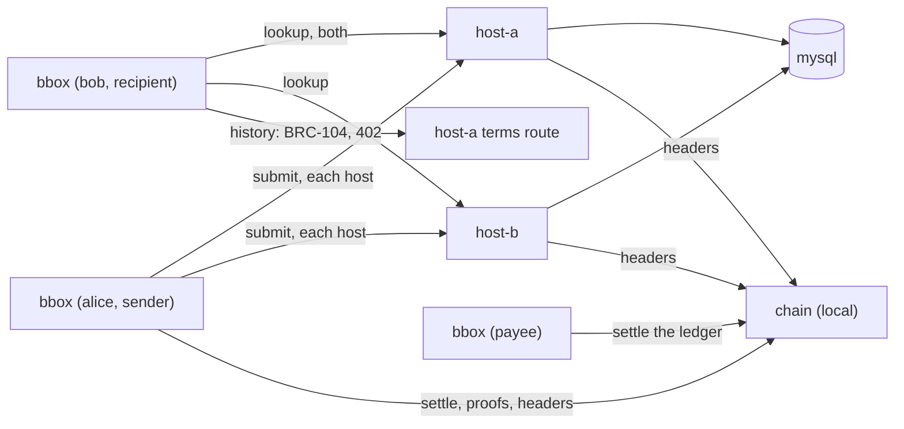

# Quickstart

Two ways in. **On a real network** (mainnet or testnet) you fund a home
from your own wallet and use overlay hosts that carry an office. **In the
development sandbox** everything runs on one machine over a private regtest
chain, and no coin is needed.

## On mainnet or testnet

You need the `bbox` command (`go install
github.com/lightwebinc/bbox/cmd/bbox@latest`, or a release tarball), a
wallet holding a little BSV (testnet coin for `-network test`), and the
overlay hosts that carry your office. No node is needed.

| Setting | What it is |
| --- | --- |
| `hosts` (and `facade` on the multicast plane) | overlay hosts that carry your office: run your own with the `bbox-host` image ([docs/host.md](docs/host.md)), or use a provider's. No default |
| `header_url` | the header source every proof is checked against. Default `woc:main` (WhatsOnChain); your own block-headers-service (`bhs:URL`) is better |
| `chain` | where transactions, proofs and spends are read. Default `woc:main`; your own node (`asset:URL`) is better |
| `settle` | where mined transactions go. Default `arcade:main` (GorillaPool's public arcade); also `arcade:<url>`, `arc:<url>`, `rpc:<url>` |

Write the hosts in `~/.bbox/config` (every key is in
[docs/configuration.md](docs/configuration.md)):

```text
network    = main
office     = support_qzxkvbmwtr
mode       = unicast
hosts      = https://host-a.example.com,https://host-b.example.com
```

Then: install, create a home, pay the fund address it prints from your own
wallet, import that payment, and use it.

```console
$ bbox init
created /home/user/.bbox
identity     02c6...9a1e
fund address 1Kq3...Vb7 (main)
$ bbox fund -txid 5e1f...77ab
imported 1 of 1 output(s) paying 1Kq3...Vb7, 10000 sat, mined at height 970041; pool 1 output(s), 10000 sat
$ bbox doctor
$ bbox send 03a1...77c2 -m 'hello from bbox'
$ bbox list
$ bbox read
$ bbox ack -all
```

`fund -txid` waits for one confirmation. To import the payment at once,
hand over the BEEF your wallet gives you instead: `bbox fund -beef
payment.beef` (or `-` for standard input). Its coin is spendable once it
mines.

**What it costs.** bbox pays the network's rate, 100 satoshis per 1000
bytes, with a floor of 100 satoshis a transaction (`fee_rate`,
`fee_floor`). A 32-output funding tree is about 1,700 bytes and pays the
rate on its size, about 170 satoshis, so about 6 satoshis an envelope or a receipt, its funding output
included; a sweep is one small transaction. 10,000 satoshis is about
fifteen hundred envelopes. Reading is free.

**Testnet.** The same, with `network = test` (the defaults become
`woc:test` and `arcade:test`) and testnet coin from a faucet or your
testnet wallet. The fund address is then a testnet address (`m...` or
`n...`).

[docs/user-guide.md](docs/user-guide.md) explains every step, and
[docs/examples.md](docs/examples.md) has commands for the common tasks.

## Development sandbox: a private regtest chain, no coin needed

In about five minutes, on one machine: run two overlay hosts that carry an
office, send a message to both in unicast mode, read it and acknowledge it,
send a payment inside a message and take it into the recipient's wallet,
pay a host's 402 for the priced history question, and settle that payment
as the host's payee. No coin is needed, because a local regtest chain
(`bbox-devchain`) stands in for the network and the homes are funded by
mining coinbase on it. **Coinbase: only on a regtest chain you run
(development and tests).** Nothing mined here is money.

You need [Docker](https://docs.docker.com/get-docker/) with Compose, and
this repository (or just its `deploy/quickstart/compose.yaml`).



### 1. Start the local chain

```console
$ cd deploy/quickstart
$ docker compose up -d chain
$ as() { who=$1; shift; docker compose run --rm -T -e BBOX_HOME=/home/nonroot/.bbox/$who bbox "$@"; }
```

`chain` is a stand-in for the network: it serves a node's API, mines every
transaction it is sent at once, and is the header source the hosts and
`bbox` check proofs against. Nothing it mines is money. The `bbox` service
is configured for it and for the two hosts, in unicast mode (the settings
are in `compose.yaml`). `as alice ...` runs it with alice's home; each
identity has its own.

The images are `ghcr.io/lightwebinc/bbox`, `bbox-host` and
`bbox-devchain`. To build them from a checkout instead of pulling them:
`make docker-build` and `make docker-build-host REFERENCE_HOST_IMAGE=<the
reference overlay host image>`.

### 2. Three identities, an office, the payee key

```console
$ as alice init && as alice fund           # coinbase: regtest sandbox only
$ as bob init | tee bob.txt && as bob fund # coinbase: regtest sandbox only
created /home/nonroot/.bbox/bob
identity     03a1…77c2
fund address mw3q…Xk9 (regtest)
$ BOB=$(sed -n 's/^identity *//p' bob.txt)
$ as payee init
$ as bob office new post | tee office.txt
office post_uqkfzmhbwd
topic  tm_bbox_post_uqkfzmhbwd
host   BBOX_OFFICES=post_uqkfzmhbwd
$ sed -n 's/^host *//p' office.txt > .env
$ as payee payee key -out - >> .env
```

`init` made an identity key: bob's is his address, the key a sender seals
to. `fund` with no `-txid` mined 101 blocks of coinbase to each fund
address on the sandbox chain, so one block's coin is mature. Coinbase:
only on a regtest chain you run (development and tests); on a real network
you fund with `bbox fund -txid` instead. The office's name gets a random suffix, so nobody else's office
shares its topic, and the `host` line is what a host needs to carry it.
The payee is the identity host-a is paid to for the history question; its
key goes to host-a as `BBOX_PAYEE_KEY`. `.env` hands both lines to the
hosts, and the office to the `bbox` service.

### 3. Start two hosts

```console
$ docker compose up -d
$ as bob doctor
...
mode        unicast: every object to each of 2 host(s), published once 2 take it (quorum all)
host        http://host-a:8080 answering
host        http://host-b:8080 answering
history     http://host-a:8090 serves terms (2 priced class(es))
```

The first start takes a few seconds while MySQL initializes; run `doctor`
again until both hosts answer.

### 4. Send, list, read, acknowledge

```console
$ as alice send $BOB -m 'hello bob, from the quickstart' | tee sent.txt
sent    8b0e…12fa
office  post_uqkfzmhbwd
to      03a1…77c2
box     inbox
host http://host-a:8080: took 1 object(s), missed 0
host http://host-b:8080: took 1 object(s), missed 0
$ TX=$(sed -n 's/^sent *//p' sent.txt)
$ as bob list
2026-01-05T10:02:11Z  8b0e…12fa  from 02c6…9a1e  box inbox  1874B  [http://host-a:8080, http://host-b:8080]
$ as bob read $TX
envelope 8b0e…12fa
...
hello bob, from the quickstart
$ as bob ack $TX
acknowledged 1 envelope(s) in post_uqkfzmhbwd with receipt 1c7d…0b3e
$ as bob list
```

`send` encrypted the message to bob's key, sealed it in a signed envelope,
and sent its carrier to both hosts; its funding tree was minted and mined
first. `list` asked both hosts, checked every envelope against the headers
and the hosts' own rules, and compared the answers: both hosts agree.
`read` decrypted it and filtered it for the terminal. `ack` published a
receipt, and neither host answers the envelope to the free questions again.
Exit status is `0` done, `1` refused, `2` a usage or transport error, `3`
incomplete (the hosts disagree).

### 5. A payment inside a message

```console
$ as alice send $BOB -m 'for the coffee' -pay 5000 | tee paid.txt
...
payment 5000 sat in 77d2…e1a0, not broadcast: the recipient internalizes it
$ as bob internalize $(sed -n 's/^sent *//p' paid.txt)
internalized 5000 sat from 02c6…9a1e: payment 77d2…e1a0, pool 103 output(s), 510000005000 sat
acknowledged 3f9a…c410 with receipt 5a0c…9d12
```

The payment rode inside the encrypted message, never broadcast by alice:
no host could see it or broadcast it. `internalize` checked it (its
timing, its outputs against the key bob derives, its proof), broadcast it,
waited for it to mine, added it to bob's pool, and acknowledged the
message.

### 6. The priced question, and the payee

```console
$ as bob terms
service ls_bbox, terms 1
history        5 sat a question
history-after  5 sat a question
$ as bob history
paid 5 sat to 03d4f2a9c1b7 in 0e8f…4c21, broadcast by the host for its payee to settle
2026-01-05T10:02:11Z  8b0e…12fa  from 02c6…9a1e  box inbox  1874B
...
$ as payee payee settle /var/lib/bbox-a/payments.jsonl
settled 0e8f…4c21: 5 sat for history from 03a1b2c3d4e5
1 payment(s) settled, 5 sat; 0 settled before; 0 not settled; 0 refused (0 before); pool 1 output(s), 5 sat
```

`history` asked host-a's terms route over BRC-104; host-a answered 402 with
its price, `bbox` paid it from bob's pool (BRC-105) and asked again, and
host-a answered what it keeps that is no longer open. Host-a recorded the
payment and did not broadcast it; until the payee settles it, bob could
still spend those coins elsewhere. `payee settle` took it into the payee's
wallet: checked, broadcast, mined, pooled.

With no arcade on the local chain, the host cannot take a payment on the
network's word: it holds it for confirmation (`202 ERR_PAYMENT_HELD`), and
`bbox` says so, broadcasts the payment, waits for it to mine (seconds
here; up to 10 minutes) and sends the same payment again, which buys the
answer. The host sees it mine through the local chain's asset API
(`BBOX_ASSET_URL` in compose.yaml).


### 7. Retract

```console
$ as alice send $BOB -m 'take this back' | tee gone.txt
$ as alice drop $(sed -n 's/^sent *//p' gone.txt)
retracted 1 funding output(s) of 6a41…e3b0: sweep 9e2c…5f18 mined at height 915, published to post_uqkfzmhbwd
$ as bob list
```

`drop` spent the funding output the message's carrier spent, in a mined
transaction, and sent it to both hosts: neither answers the message again.
Retraction reaches honest hosts only: it is not erasure.

### 8. Clean up

```console
$ docker compose --profile cli down -v
```

### From the sandbox to a real network

- **The chain.** Point `asset`, `settle` and `header_url` at a node, a
  settlement leg and a header source you trust, set `network`, and fund
  each home with `bbox fund -txid` from a payment you send from your own
  wallet to its fund address (the first section of this page). Every carrier, receipt and sweep is then paid for: a
  funding tree of 32 outputs costs a few thousand satoshis, and a sweep is
  one small transaction.
- **The plane.** With a multicast plane, set `mode = plane` and `facade`:
  each object is submitted once and every subscribed host receives it.
- **Hosts.** A host is the `bbox-host` image, or the module on any
  reference overlay host (docs/host.md); a host that prices a question
  settles on a schedule, and backs up its state directory daily.
- **A host that missed something.** In unicast a host that was down misses
  what was sent meanwhile; `bbox list -fill` copies an envelope one host
  has across to one that lacks it.
- **Next.** [docs/user-guide.md](docs/user-guide.md) explains the concepts
  and the day-to-day use; [docs/limits.md](docs/limits.md) every default
  and cap.
