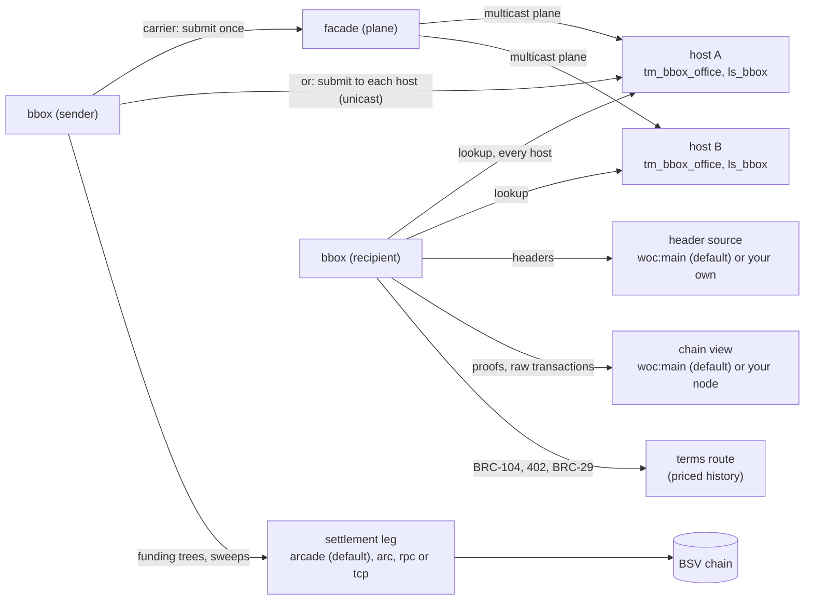

# Architecture

bbox is a message box whose server is a set of overlay hosts. It has three
parts: the `bbox` command (a sender's and a recipient's client), the host
module (a topic manager and a lookup service loaded by an ordinary overlay
host), and the Go packages the command is built from. The normative
description is [spec.md](spec.md); this page is the map.

## Components

| Component | Where | What it does |
| --- | --- | --- |
| `bbox` command | `cmd/bbox` | identity home, offices, send, list, read, ack, internalize, drop, history, payee settle, doctor |
| Record codec | `boxrec` | the envelope and receipt records, the BRC-169 content, the plaintext and payment rules, the name grammars |
| Publisher | `send` | seals, persists, mints funding trees, publishes and retracts, over one identity's home |
| Reader | `reader` | asks every host the `ls_bbox` questions, verifies every answer against the caller's headers, applies the recipient's checks |
| Host module | `host/` (TypeScript) | `tm_bbox_<office>` admits carriers, receipts and sweeps; `ls_bbox` answers the lookup classes; an optional terms route sells history |
| Sender's builders | `host/src/send.ts` (TypeScript) | the twins of `boxrec.Seal`, `SealEnvelope`, `EncodePlaintext`, the payment's BRC-29 destination and member, and the envelope carrier (bcommon's `mintCarrier`), every key operation through a BRC-100 wallet, held to `envelope-v1.json`, `transaction-v1.json` and `payment-v1.json`; for a page that sends through the user's wallet. Not part of the host module's bundle |
| Local chain | `cmd/devchain` | a regtest stand-in node and header source for the development sandbox and tests; coinbase only on this chain |

The shared building blocks (the embedded wallet and coin pool, minting,
the chain view and header clients, the fee policy, the facade and settlement legs, payment
acceptance) come from [bcommon](https://github.com/lightwebinc/bcommon);
signatures, scripts and BEEF from
[go-sdk](https://github.com/bsv-blockchain/go-sdk).

## Data flow

1. **Funding.** `bbox init` creates a home with an identity key and an
   empty coin pool and prints a fund address. The user sends coin from
   their own wallet to it, and `bbox fund -txid` imports the mined payment
   after checking its proof against the header source.
2. **A funding tree.** The first `send` mints a mined transaction of
   `tree_count` outputs (32 by default) from the pool through the
   settlement leg, and waits for its block. A new tree is minted ahead
   before the current one runs out.
3. **An envelope.** `send` encrypts the message to the recipient's key
   (BRC-78), signs the BRC-169 envelope, and builds a carrier: an unmined
   transaction that spends one tree output and holds the record. The
   carrier is persisted in the home, then submitted as BEEF to the facade
   (plane) or to every host (unicast). It is never mined.
4. **Admission.** Each host's `tm_bbox_<office>` checks the carrier's
   shape, its BEEF and the tree's proof against the host's headers, the
   record, and the signatures, then indexes it. One funding output answers
   one carrier for the host's life.
5. **Reading.** `bbox list` and `read` ask every configured host, verify
   every answer themselves against `header_url`, compare the hosts, and
   decrypt. `ack` publishes a receipt: a carrier on the recipient's own tree.
6. **Payments.** `send -pay` puts an unbroadcast BRC-29 payment inside the
   encrypted message; `internalize` checks it, broadcasts it through the
   settlement leg and adds it to the recipient's pool.
7. **Retraction.** `drop` mines a sweep of the envelope's funding output
   and publishes it; honest hosts stop answering the envelope.

## Trust model

- **Hosts are replicas.** A host can withhold; it cannot forge, alter or
  read an envelope. Reading from several hosts exposes withholding.
- **The header source is the root of trust.** Every proof is checked
  against the headers of the one source you configure. `woc:main` checks
  each header's work locally; your own header source is stronger.
- **What is public.** Who wrote to whom, when, in which box and office, and
  the envelope's size. The body, any payment and any references are not.
- **The chain view and settlement leg** are trusted for availability:
  what they return is checked (proofs against headers, transactions by
  txid). The one thing taken on their word is an absence: that an output
  is unspent, or a transaction not known or not mined. With no node that
  is WhatsOnChain's word; a node of your own (`chain = asset:URL`) removes
  it.

## State

The home (`~/.bbox`, mode 0700) holds `identity.json` (the key),
`wallet.json` (the coin pool), `state.json` (trees, outbox, sent records,
sweeps, read records) and a lock. Everything is written before it leaves
the machine, so a command that stops part way is finished by the next
one; [usage.md](usage.md) has the recovery rules. A host keeps its own
state directory ([host.md](host.md)).

## Networks

`network` is `main`, `test` or `regtest`. It sets the fund address prefix
and the proof-of-work floor a header source is held to. On `main` and
`test` a home is funded only by importing a payment (`fund -txid` or
`fund -beef`), and the chain services default to public ones, so no node
is needed. On
`regtest` (the development sandbox) a home can also be funded by mining
coinbase; coinbase: only on a regtest chain you run (development and
tests).
